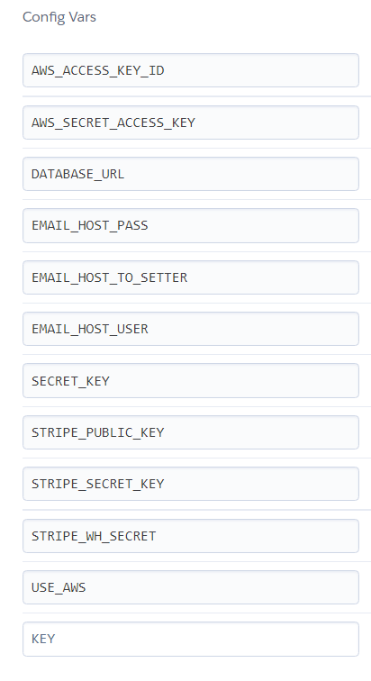

Welcome Coder731,

This is the Code Institute student template for Gitpod. We have preinstalled all of the tools you need to get started. It's perfectly ok to use this template as the basis for your project submissions.

You can safely delete this README.md file, or change it for your own project. Please do read it at least once, though! It contains some important information about Gitpod and the extensions we use. Some of this information has been updated since the video content was created. The last update to this file was: **September 1, 2021**

## Gitpod Reminders

To run a frontend (HTML, CSS, Javascript only) application in Gitpod, in the terminal, type:

`python3 -m http.server`

A blue button should appear to click: _Make Public_,

Another blue button should appear to click: _Open Browser_.

To run a backend Python file, type `python3 app.py`, if your Python file is named `app.py` of course.

A blue button should appear to click: _Make Public_,

Another blue button should appear to click: _Open Browser_.

In Gitpod you have superuser security privileges by default. Therefore you do not need to use the `sudo` (superuser do) command in the bash terminal in any of the lessons.

To log into the Heroku toolbelt CLI:

1. Log in to your Heroku account and go to *Account Settings* in the menu under your avatar.
2. Scroll down to the *API Key* and click *Reveal*
3. Copy the key
4. In Gitpod, from the terminal, run `heroku_config`
5. Paste in your API key when asked

You can now use the `heroku` CLI program - try running `heroku apps` to confirm it works. This API key is unique and private to you so do not share it. If you accidentally make it public then you can create a new one with _Regenerate API Key_.

------

## Release History

We continually tweak and adjust this template to help give you the best experience. Here is the version history:

**September 1 2021:** Remove `PGHOSTADDR` environment variable.

**July 19 2021:** Remove `font_fix` script now that the terminal font issue is fixed.

**July 2 2021:** Remove extensions that are not available in Open VSX.

**June 30 2021:** Combined the P4 and P5 templates into one file, added the uptime script. See the FAQ at the end of this file.

**June 10 2021:** Added: `font_fix` script and alias to fix the Terminal font issue

**May 10 2021:** Added `heroku_config` script to allow Heroku API key to be stored as an environment variable.

**April 7 2021:** Upgraded the template for VS Code instead of Theia.

**October 21 2020:** Versions of the HTMLHint, Prettier, Bootstrap4 CDN and Auto Close extensions updated. The Python extension needs to stay the same version for now.

**October 08 2020:** Additional large Gitpod files (`core.mongo*` and `core.python*`) are now hidden in the Explorer, and have been added to the `.gitignore` by default.

**September 22 2020:** Gitpod occasionally creates large `core.Microsoft` files. These are now hidden in the Explorer. A `.gitignore` file has been created to make sure these files will not be committed, along with other common files.

**April 16 2020:** The template now automatically installs MySQL instead of relying on the Gitpod MySQL image. The message about a Python linter not being installed has been dealt with, and the set-up files are now hidden in the Gitpod file explorer.

**April 13 2020:** Added the _Prettier_ code beautifier extension instead of the code formatter built-in to Gitpod.

**February 2020:** The initialisation files now _do not_ auto-delete. They will remain in your project. You can safely ignore them. They just make sure that your workspace is configured correctly each time you open it. It will also prevent the Gitpod configuration popup from appearing.

**December 2019:** Added Eventyret's Bootstrap 4 extension. Type `!bscdn` in a HTML file to add the Bootstrap boilerplate. Check out the <a href="https://github.com/Eventyret/vscode-bcdn" target="_blank">README.md file at the official repo</a> for more options.

------

## FAQ about the uptime script

**Why have you added this script?**

It will help us to calculate how many running workspaces there are at any one time, which greatly helps us with cost and capacity planning. It will help us decide on the future direction of our cloud-based IDE strategy.

**How will this affect me?**

For everyday usage of Gitpod, it doesn’t have any effect at all. The script only captures the following data:

- An ID that is randomly generated each time the workspace is started.
- The current date and time
- The workspace status of “started” or “running”, which is sent every 5 minutes.

It is not possible for us or anyone else to trace the random ID back to an individual, and no personal data is being captured. It will not slow down the workspace or affect your work.

**So….?**

We want to tell you this so that we are being completely transparent about the data we collect and what we do with it.

**Can I opt out?**

Yes, you can. Since no personally identifiable information is being captured, we'd appreciate it if you let the script run; however if you are unhappy with the idea, simply run the following commands from the terminal window after creating the workspace, and this will remove the uptime script:

```
pkill uptime.sh
rm .vscode/uptime.sh
```

**Anything more?**

Yes! We'd strongly encourage you to look at the source code of the `uptime.sh` file so that you know what it's doing. As future software developers, it will be great practice to see how these shell scripts work.

---

Happy coding!


# References
- [contact form in Django](https://ordinarycoders.com/blog/article/build-a-django-contact-form-with-email-backend)

# Tutorials
- [Contact Pages in Django - Python Django Dentist Website #6](https://www.youtube.com/watch?v=w4ilq6Zk-08&ab_channel=Codemy.com)
- [How To Send Email With Django - Python Django Dentist Website #7](https://youtu.be/xNqnHmXIuzU?t=41)

# Git commit messages
- [How to write multiline git commit messages](https://youtu.be/MOfBw3eGC08?t=167)

-[Property Shark](https://www.propertyshark.com/cre/commercial-property/us/ny/brooklyn/kings-plaza-1/)

- [Google Maps](https://www.google.com/maps/place/733+Third+Avenue/@40.7528964,-73.9722049,17z/data=!4m5!3m4!1s0x89c25902bb24e511:0xdcddc05af1f5f54f!8m2!3d40.7528964!4d-73.9722049)

- [responsive Google Maps](https://blog.duda.co/responsive-google-maps-for-your-website)

- [footer](https://www.foolishdeveloper.com/2021/09/responsive-footer-design.html)

# Django Docs:
-[template inheritance](https://docs.djangoproject.com/en/dev/topics/templates/#template-inheritance)

# Technologies used:
- [find unclosed html tags](https://www.aliciaramirez.com/closing-tags-checker/)
- [black.vercel.app Black v22.6.0 - The uncompromising Python code formatter.](https://black.vercel.app/?version=stable&state=_Td6WFoAAATm1rRGAgAhARYAAAB0L-Wj4APbAX1dAD2IimZxl1N_Wm_NXb2Os8irB1MDqzQDcQtisNWJvDnFDNHhUDbG_J14txUsT_cq67-JL-tIMEdhLUx59fJBtgkYugEKAX3fOkFkoE5PXN-eW11nCGaaeFErI_10l0QEGyiGAmQZEAXwS7GaFy9Ul0MuTyjpaD9_cwI-B2i9qCx0mQpryLQQUQy-O7AaS37gGmhJaS8twO7U5fJF4bYV0sSM6xF5F9-bbL5Nci0D_qsaC6Kbabxx0K4c6hSv3oSNXwg0zTQYktluZUAWNOQz5EwSwx91rifAwvg4bBYdvcPvvRU_EsRbHdhaf5rDwGdV7xoGxUQsWqCUZ0JPE1yUaLaIh1NuxrdCR304ii3WZizFGhEhe6RlSh6KFVFa2lmgRjR3lcR6D6N4fqrtsjf9mH8IhpQrlVANQncrzK6qmIzNtYxg7Px6N6pSGuIArkin51B6QzlqQcSDQhA1T4y8931h-Ia913xyu7dO7rz6znJl-C_lCyZk6TuzdlCCAAAAAABFZlemHWB38wABmQPcBwAAIvlR17HEZ_sCAAAAAARZWg==)
- [heroku](https://www.heroku.com/)
- [AWS S3](https://aws.amazon.com/)
- [GitPod](https://www.gitpod.io/)
- [GitHub](https://github.com/)
- [Visual Studio Code](https://code.visualstudio.com/)
- [Code Institute](https://codeinstitute.net/global/)
- [Bootstrap](https://getbootstrap.com/)


# Django and Packages
- [Django](https://www.djangoproject.com/)
- [Django allauth](https://django-allauth.readthedocs.io/en/latest/installation.html)
- [Django countries](https://pypi.org/project/django-countries/)
- [dj-database-url](https://pypi.org/project/dj-database-url/)
- [django-crispy-forms](https://django-crispy-forms.readthedocs.io/en/latest/)
- [django-storages](https://django-storages.readthedocs.io/en/latest/)
- [gunicorn](https://gunicorn.org/)
- [Pillow](https://pillow.readthedocs.io/en/stable/)

# Other technologies
- [stripe](https://stripe.com/)

# Repositories
- [Code-Institute-Solutions / boutique_ado_v1](https://github.com/Code-Institute-Solutions/boutique_ado_v1)

# Bootstrap
## Footer
- [Header and footer](https://getbootstrap.com/docs/4.4/components/card/#header-and-footer)
- [Bootstrap grid examples](https://getbootstrap.com/docs/3.4/examples/grid/) 
- [Bootstrap: Force columns to stack up vertically on mobile (responsive design)](https://stackoverflow.com/questions/29825427/bootstrap-force-columns-to-stack-up-vertically-on-mobile-responsive-design)

# How do urls work
[urls - Django Documentation](https://docs.djangoproject.com/en/4.0/topics/http/urls/)

# Bug 
## Error:
- [ModuleNotFoundError: No module named 'contact.urls'](https://www.google.com/search?q=ModuleNotFoundError%3A+No+module+named+%27contact.urls%27&oq=ModuleNotFoundError%3A+No+module+named+%27contact.urls%27&aqs=chrome..69i57j69i58.10334j0j7&sourceid=chrome&ie=UTF-8)
## Reference
- [Stackoverflow - No module named urls](https://stackoverflow.com/questions/2353416/no-module-named-urls)

# import settings to views.py in contact app
- [How to pass a variable from settings.py to a view?](https://stackoverflow.com/questions/3984648/how-to-pass-a-variable-from-settings-py-to-a-view)
- [Using settings in Python code](https://docs.djangoproject.com/en/dev/topics/settings/#using-settings-in-python-code)

# Media References
(Note: image links are also in products/fixtures/products.json)
- [clarinet-hd-compressed.png](https://cdn.pixabay.com/photo/2016/11/29/17/14/clarinet-1870572_960_720.png)
- [flute-hd-compressed.png](https://cdn.pixabay.com/photo/2015/08/18/12/43/flute-893911_960_720.jpg)
- [guitar-hd-compressed.png](https://images.unsplash.com/photo-1514649923863-ceaf75b7ec00?ixlib=rb-1.2.1&ixid=MnwxMjA3fDB8MHxwaG90by1wYWdlfHx8fGVufDB8fHx8&auto=format&fit=crop&w=1887&q=80)
- [harmonica-c-major-hd-compressed.png](https://cdn.pixabay.com/photo/2015/02/18/20/23/harmonica-641425_960_720.jpg)
- [saxophone-hd-compressed.png](https://cdn.pixabay.com/photo/2016/07/24/16/28/saxophone-1538743_960_720.png)
- [trombone-hd-compressed.png](https://toppng.com/show_download/121237/trombone-png/large)
- [alt link to trombone image with embeddable script](https://toppng.com/trombone-png-PNG-free-PNG-Images_121237)
- [trumpet-hd-compressed.png](https://images.unsplash.com/photo-1573871669414-010dbf73ca84?ixlib=rb-1.2.1&ixid=MnwxMjA3fDB8MHxwaG90by1wYWdlfHx8fGVufDB8fHx8&auto=format&fit=crop&w=1887&q=80)
- [tuba-bb-hd-compressed.png](https://flyclipart.com/john-packer-bb-tuba-tuba-png-439710)
- [violin-hd-compressed.png](https://images.unsplash.com/photo-1612225330812-01a9c6b355ec?ixlib=rb-1.2.1&ixid=MnwxMjA3fDB8MHxwaG90by1wYWdlfHx8fGVufDB8fHx8&auto=format&fit=crop&w=870&q=80)

# Ignoring Errors with Flake8
- Used in portfolio_project_5_v4/urls.py on last line, as the command ```# noqa: F811,E501``` [Ignoring Errors with Flake8](https://flake8.pycqa.org/en/3.1.1/user/ignoring-errors.html)
# Note on dependabot security update
As per the LMS Tutorial which mentioned incorporating dependabot 
security updates, one of the options given was
to simply merge the pull request from the 
dependabot which only added 3 characters to the 
project ".14" to update Django from 3.2 to 3.2.14
so that the project was no longer susceptible
to what were deemed by the bot to be
critical security vulnurabilities
allowing the potential
for SQL injection.
However, the tutorial mentioned that this would not be applicable here,
but since issued the severity had increased, so it 
was decided to merge the pull request,
which led to 2 contributors being listed
on the project
i.e. the first being the author and
the second being the dependabot
(for adding ".14" to the requirements.txt file on a single merge commit).
[commit 0218233861c9ce95cf75731a46a584361da3a17f Showing 1 changed file with 1 addition and 1 deletion.](https://github.com/Coder731/portfolio_project_5_v4/commit/0218233861c9ce95cf75731a46a584361da3a17f)
In a previous trial run at this project, the commit was done manually,
which did not result in the dependabot being listed as a contributor,
so it was quite surprising when
accept security update was selected
that dependabot was listed 
as a contributor.

# ToDo / Further work:
## Testing

## Unfinished elements
Due to time constraints:
- the review model needs more refinement.
- ideally edit button would handle the issue
of one review per customer.

## SEO
meta tags

## Marketing
Facebook

## Add link to contact app


# Reference for todo app
- used for todo  app [Django To Do List App With User Registration & Login](https://youtu.be/llbtoQTt4qw?t=237

# Testing

the following sites are working on the local site:
[/todo/](https://8000-coder731-portfolioproje-cy03inats4r.ws-eu59.gitpod.io/todo/)
[/todo/task/1/](https://8000-coder731-portfolioproje-cy03inats4r.ws-eu59.gitpod.io/todo/task/1/)
[/todo/task/2/](https://8000-coder731-portfolioproje-cy03inats4r.ws-eu59.gitpod.io/todo/task/2/)
[/contact/](https://8000-coder731-portfolioproje-cy03inats4r.ws-eu59.gitpod.io/contact/)

the following sites have been tested on the heroku deployed app:
[/products/](https://portfolio-project-5-v4.herokuapp.com/products/)
[]()

# Bug Fixed
Was having an issue where by all pages were giving 500 errors with deployed and local images not showing.

## Problem Statement
I have run migrations at least once today as I added two or three new models but now images are not showing on local at all except for background and not in individual product views on heroku, with the latter giving a 500 error.


## Attempts
I discovered the issue on my local so I ran another deploy on heroku to see if it was just a local issue but now the individual products are not showing there either I am not sure what to do. I have not yet tried rolling back migrations.

Redeploy heroku

## Solution:

rerun the commands:

python3 manage.py loaddata categories
python3 manage.py loaddata products

add DEVELOPMENT = 1 variable temporarily to herokku config vars

run 
heroku login -i

run 
heroku run python3 manage.py migrate --app herokuprojectappname


# Marketing

## Facebook
- [Facebook page for a business](https://sproutsocial.com/insights/facebook-business-page-guide/)

# Deployment
## Reference

## Heroku

Heroku notices python app as this files is in root folder:
- requirements.txt
This allows the Python buildpack to proceed. 
- [Deploying Python and Django Apps on Heroku](https://devcenter.heroku.com/articles/deploying-python)


## AWS
Followed Code Institute Deployment Tutorials and Changes sheet.

Amazon Web services was used to host media and static files.

S3 used.

Changes to AWS deployment:
On create bucket:
ACLs enabled, allowing objects in bucket to be owned by AWS accounts.

Object ownership:
Bucket owner preferred option selected.

Under S3 bucket settings:
The new page is scrollable as opposed to the old one where you click through each option.
Properties tab > scroll to bottom of page > static website hosting
Permissions tab > 3 settings.

## The Cross-origin resource sharing (CORS) section
The following was pasted into the CORS section:

```
[
    {
        "AllowedHeaders": [
            "Authorization"
        ],
        "AllowedMethods": [
            "GET"
        ],
        "AllowedOrigins": [
            "*"
        ],
        "ExposeHeaders": []
    }
]

```

## Bucket Policy


## ACL Access control list
enabled 
List 
for
Everyone (public access)

- Accepted warning box

At this point a disabled edit button would have indicated
Object Ownership needed to be changed to ACLs enabled.

Access Control List (ACL)
both list and write options under Objects column were selected.
both read and write options under Bucket ACL column were selected.

Under Objects column: List  was enabled 

## Identity and Access Management (IAM)
### Create group
User groups selected on side bar
### Create policy
Clicked Button to go to next page to add tags.
Even though tags were  not used, 
this step is necessary to get to 
the review policy page.

### Attach policy
On sidebar User Groups clicked.
Group selected.
#### Permissions tab
Opened add permissions dropdown

# Heroku config vars
heroku config vars 
